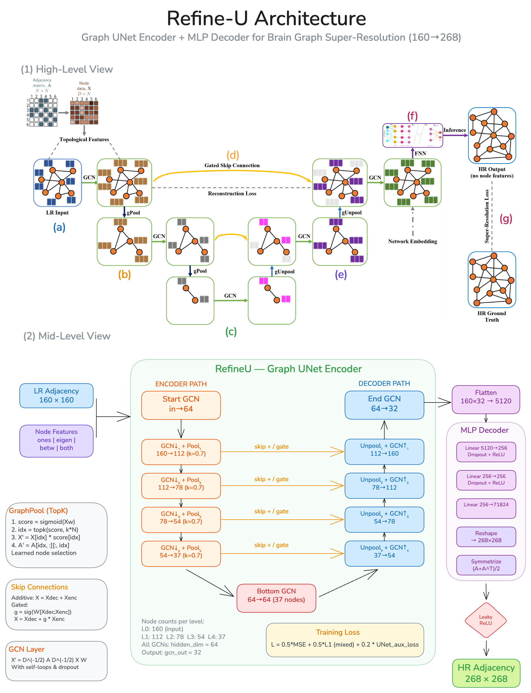
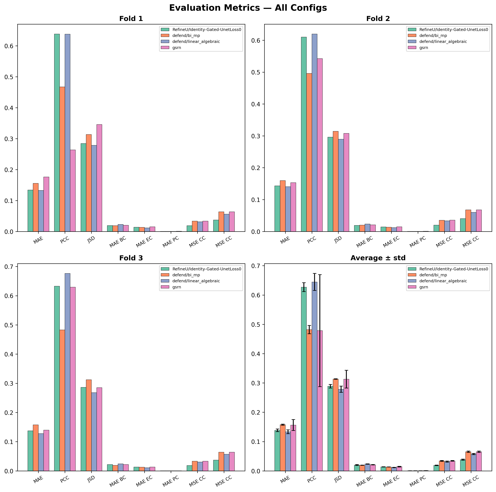
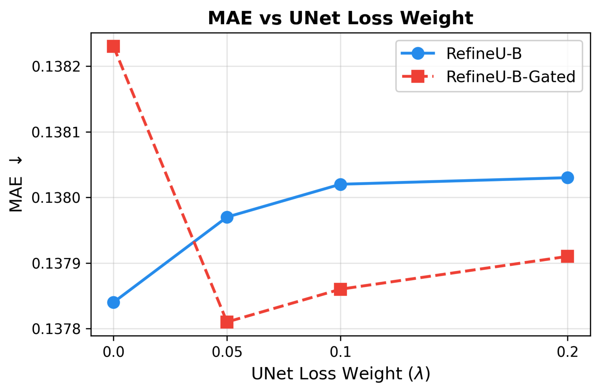

# DGL2026 Brain Graph Super-Resolution Challenge

## Contributors

| Name | CID | Shortcode |
|------|-----|-----------|
| Amit Chandra | 06063187 | ac4625 |
| Igor Lima Rocha Azevedo | 02487347 | il225 |
| Iris Liao | 06071562 | idl25 |
| Mikolas Fromm | 06055049 | mf1025 |

## Problem Description

Brain graph super-resolution aims to predict a high-resolution (HR) brain connectivity matrix (268x268 ROIs) from a low-resolution (LR) input (160x160 ROIs). Brain connectivity graphs encode structural or functional relationships between brain regions, but acquiring high-resolution connectomes is costly and time-consuming. Super-resolution allows researchers to infer fine-grained connectivity patterns from cheaper low-resolution scans, enabling broader population studies and more precise analyses of neurological conditions without requiring expensive high-resolution acquisitions for every subject.

## RefineU - Methodology

**RefineU** is a symmetric Graph UNet for brain graph super-resolution. The model consists of:

- **GCN Encoder** with learned TopK pooling that progressively coarsens the graph across 4 levels
- **Bottleneck GCN** at the coarsest resolution
- **GCN Decoder** with unpooling that restores the original node count
- **Gated skip connections** (SkipGate): learnable gates that control how much encoder information flows to the decoder, preventing gradient degradation
- **MLP head**: maps the flattened GCN output to the high-resolution 268x268 adjacency matrix, followed by symmetrization
- **Auxiliary UNet loss**: MSE reconstruction loss on encoder/decoder intermediate features, weighted by a tunable lambda

Node features are precomputed **betweenness centrality** values. Training uses 3-fold cross-validation with cosine annealing and a mixed loss (0.5 MSE + 0.5 L1). Final test predictions are ensembled by averaging across folds and clipping to [0, 1].

### Model Architecture



## Used External Libraries

Install all dependencies with:

```bash
# With uv (recommended)
uv sync

# Or with pip
pip install -r requirements.txt
```

### Dependencies

| Library | Purpose |
|---------|---------|
| `torch` >= 2.0.0 | Deep learning framework |
| `torch-geometric` >= 2.4.0 | Graph neural network operations |
| `networkx` >= 3.0 | Graph construction and centrality computation |
| `scikit-learn` >= 1.2.0 | KFold CV, MAE/MSE metrics |
| `scipy` >= 1.10.0 | Pearson correlation, Jensen-Shannon divergence |
| `pandas` >= 2.0.0 | CSV data loading |
| `numpy` >= 1.24.0 | Numerical operations |
| `matplotlib` >= 3.7.0 | Plotting |
| `seaborn` >= 0.12.0 | Statistical visualizations |
| `hydra-core` >= 1.3.0 | Configuration management (CLI training) |
| `omegaconf` >= 2.3.0 | Config composition |
| `wandb` >= 0.15.0 | Experiment tracking |
| `joblib` >= 1.2.0 | Parallelized evaluation |

## How to Train

### Jupyter Notebook (single config demo)

The notebook **`RefineU.ipynb`** demonstrates training for one of our configurations (**RefineU-B-Gated**) end-to-end — from data loading to submission CSV. It is self-contained and does not require Hydra or W&B.

### CLI Training (all model configs)

The CLI uses [Hydra](https://hydra.cc/) for configuration. To train any model, run:

```bash
uv run python train.py experiment=<experiment_name>
```

#### Available experiments

| Experiment | Description |
|------------|-------------|
| **RefineU variants** | |
| `refine_u_betweenness_gated` | RefineU + betweenness features + gated skip (best) |
| `refine_u_betweenness` | RefineU + betweenness features |
| `refine_u_eigen_gated` | RefineU + eigenvector features + gated skip |
| `refine_u_eigen` | RefineU + eigenvector features |
| `refine_u_identity_gated` | RefineU + identity features + gated skip |
| `refine_u_identity` | RefineU + identity features |
| `refine_u_all_gated` | RefineU + all features + gated skip |
| `refine_u_all` | RefineU + all features |
| **Baselines** | |
| `defend_la` | DEFEND linear algebraic |
| `defend_bimp` | DEFEND bi-directional message passing |
| `defend_bilc` | DEFEND bi-directional linear combination |
| `gsrn_baseline` | GSR-Net baseline |
| `gcn_mlp_eigen` | Traditional GCN + MLP + eigenvector features |
| `gcn_mlp_betweenness` | Traditional GCN + MLP + betweenness features |
| `gcn_mlp_identity` | Traditional GCN + MLP + identity features |

Leaky ReLU / no-leaky variants are also available by appending `_no_leaky` (e.g. `refine_u_betweenness_gated_no_leaky`).

#### Override hyperparameters inline

```bash
# Change UNet loss weight
uv run python train.py experiment=refine_u_betweenness_gated model.unet_loss_weight=0.1

# Disable W&B logging
uv run python train.py experiment=refine_u_betweenness_gated wandb.enabled=false

# Change number of epochs
uv run python train.py experiment=refine_u_betweenness_gated training.epochs=100
```

### Data

Place the dataset CSVs in `data/`:

```
data/
├── lr_train.csv
├── hr_train.csv
└── lr_test.csv
```

## Results

### Evaluation Bar Plots (3 folds + average)



### UNet Loss Weight Ablation



## References

- Isallari, M., & Rekik, I. (2021). "Brain graph super-resolution for boosting neurological disorder diagnosis." *Medical Image Analysis*.
- Gao, H., & Ji, S. (2019). "Graph U-Nets." *ICML*.
- Mhiri, I., Khalifa, A.B., & Rekik, I. (2020). "Brain Graph Super-Resolution Using Adversarial Graph Neural Network." *MICCAI*.
- Kipf, T.N., & Welling, M. (2017). "Semi-Supervised Classification with Graph Convolutional Networks." *ICLR*.
